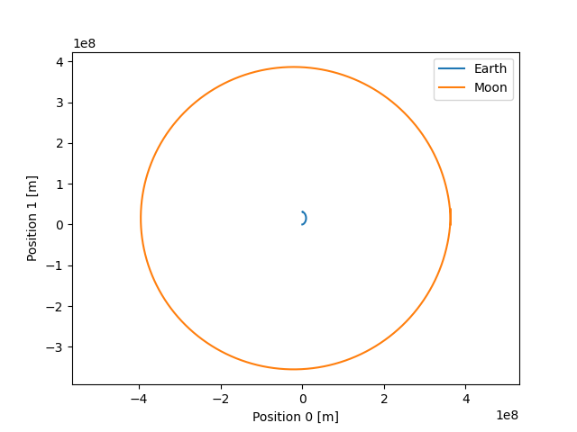
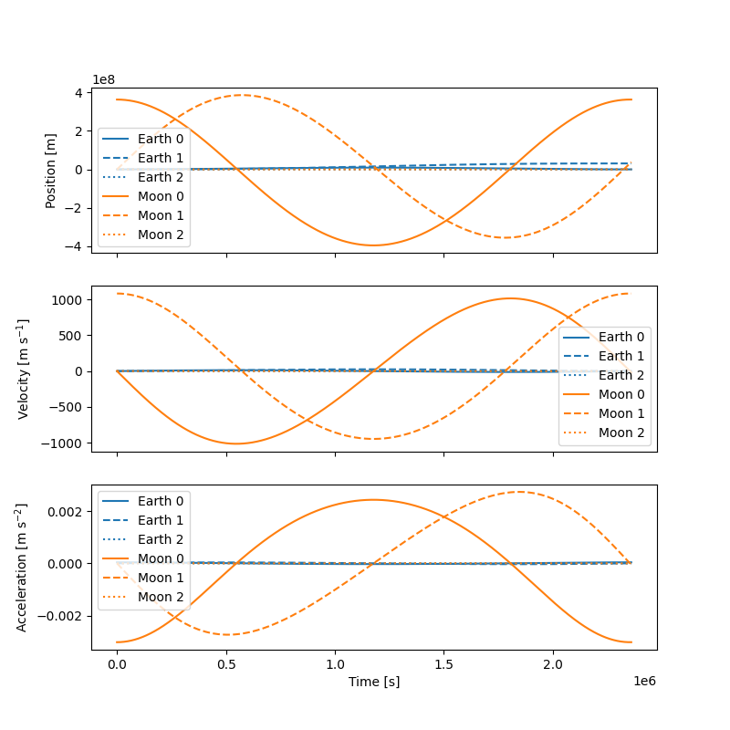

# rust-nbody
Rust practice making a gravitational n-body solver.

## Installation
### Rust
Build the rust crate:
```
cd nbody
cargo build
```

### Python
There is also a python package, for plotting results from the Rust code. To install it, first [install the poetry package manager](https://python-poetry.org/docs/#installation).

Then:
```
cd nbody/python
poetry install
```

## Example

This example simulates the motion of the Earth and Moon over a period of one month. To run it:

```
cd nbody
cargo run -- examples/earth_moon.json earth_moon_result.csv
```

This loads the simulation configuration from `examples/earth_moon.json`, runs the simulation, and writes the resulting trajectories to `earth_moon_result.csv`.

To plot the trajectories:
```
cd python
poetry run nbody-plot ../earth_moon_result.csv
```

This should show the following plots:




